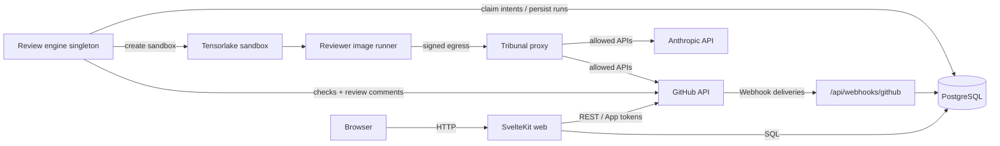
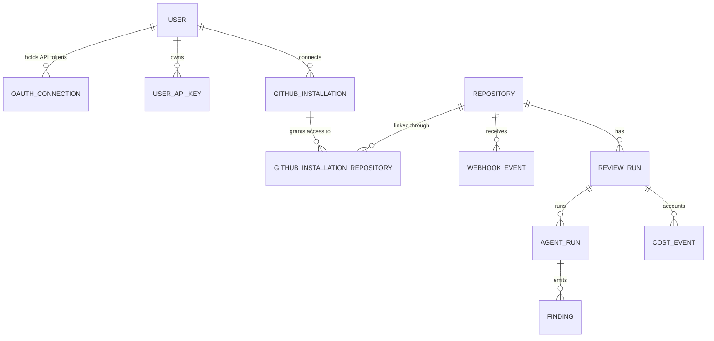
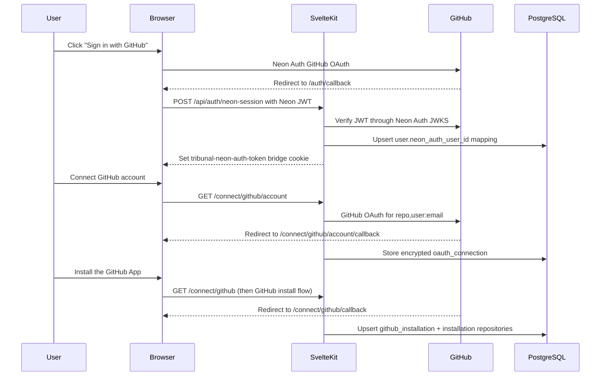

# Architecture

## System Overview

Tribunal is a SvelteKit web application plus a containerized review engine, proxy, and reviewer
runner. A developer logs in with GitHub, installs the Tribunal GitHub App on their accounts and
organizations, browses repositories and pull requests, configures review agents, and inspects review
runs and estimated costs. GitHub remains the only product integration; Anthropic and Tensorlake are
runtime dependencies of the review execution path.

Core technologies:

- SvelteKit + Svelte 5: https://svelte.dev/docs/kit
- Drizzle ORM: https://orm.drizzle.team/docs/overview
- PostgreSQL (Neon in production): https://neon.com/docs
- Bun (tooling/runtime): https://bun.sh/docs
- Turborepo (task orchestration): https://turbo.build/repo/docs
- Weft durable workflows: https://github.com/lostgradient/weft

There are three application containers in the MVP topology:

- `applications/web`: SvelteKit web UI, authentication, GitHub webhooks, operator pages, and test-only E2E harness.
- `applications/engine`: singleton review workflow consumer, Weft runtime, sandbox orchestration, GitHub review posting, and cost reconciliation.
- `applications/proxy`: signed egress boundary for reviewer sandboxes.

The `runner` directory builds the reviewer sandbox image. Its boot self-check verifies both system
tools and runtime imports used by `runner/run-agent.mjs`.

## Request Flow Diagram



Pull requests are read live from the GitHub API at render time (see
`applications/web/src/routes/(authenticated)/repositories/[repositoryId=int]/pull-requests/+page.server.ts`).
Review run state, agent runs, findings, cost events, and operator settings are stored in the
database.

## Directory Structure

```text
.
├─ applications/
│  ├─ web/                 SvelteKit application and operator UI
│  ├─ engine/              singleton review workflow consumer
│  └─ proxy/               signed reviewer egress boundary
│     ├─ src/
│     │  ├─ lib/           shared modules and server logic
│     │  │  ├─ api-keys/   user API key helpers
│     │  │  ├─ components/ app-specific Svelte components
│     │  │  ├─ constants/  shared constants
│     │  │  ├─ server/     server-only code (DB, auth, GitHub, rate limit)
│     │  │  └─ utilities/  shared utilities
│     │  ├─ routes/        pages and API endpoints
│     │  └─ params/        route param matchers
│     ├─ test/             test harnesses and fixtures
│     └─ static/           static assets served as-is
├─ packages/
│  ├─ agents/              @tribunal/agents — reviewer definitions, tools, and read-only hooks
│  ├─ cost/                @tribunal/cost — estimate and reconciliation ledger helpers
│  ├─ database/            @tribunal/database — schema, connection factory, operators, queries, validation
│  ├─ github/              @tribunal/github — GitHub integration domain logic, cache, error taxonomy
│  ├─ review-core/         @tribunal/review-core — review ports, schemas, and tokens
│  ├─ sandbox/             @tribunal/sandbox — Tensorlake sandbox adapter
│  ├─ test/                @tribunal/test — shared test utilities
│  └─ typescript/          @tribunal/typescript — shared TypeScript configuration
├─ runner/                 reviewer sandbox entrypoint and image self-check
├─ documentation/          long-form docs and guides
├─ scripts/                repo automation and tooling
└─ .claude/ .codex/        agent rules, skills, and automation
```

## Workspace Packages

The repository uses Bun workspaces with Turborepo for task orchestration. All packages are installed
from the root with a single `bun install`, and `@tribunal/*` names resolve directly to the workspace
packages — there is no TypeScript `paths` mapping for them.

**`@tribunal/agents`** (`packages/agents/`) — Agent definitions, read-only tool metadata, finding
validation, and hook policy enforcement used by the reviewer image.

**`@tribunal/review-core`** (`packages/review-core/`) — Shared review schemas, port types,
capability-token helpers, and review payload contracts.

**`@tribunal/github`** (`packages/github/`) — GitHub integration domain logic with no framework
dependency. Functions take a `GithubServiceContext` (database, cache, GitHub App) as their first
argument. Covers installations, repositories, pull requests, issues, and webhook parsing/routing.
Also exports the Redis cache utilities (`@tribunal/github/cache`, `@tribunal/github/cache/keys`) and
the retry-aware error taxonomy (`@tribunal/github/error-taxonomy`, distinguishing retryable from
non-retryable failures such as `ValidationError` and `RateLimitError`).

**`@tribunal/database`** (`packages/database/`) — Database schema, connection factory, Drizzle
operators, query helpers, and Zod validation schemas (`@tribunal/database/validation/user-api-key`).
Depends on Drizzle ORM and `@neondatabase/serverless`. This is the single source of truth for all
table definitions.

Additional supporting packages: **`@tribunal/cost`** (cost ledger), **`@tribunal/sandbox`**
(sandbox adapter), **`@tribunal/test`** (test utilities), and **`@tribunal/typescript`** (shared
TypeScript configuration).

## Path Aliases

| Alias        | Available in | Points to                    | Purpose                                                        |
| ------------ | ------------ | ---------------------------- | -------------------------------------------------------------- |
| `$lib/*`     | Web app only | `applications/web/src/lib/*` | SvelteKit built-in convention                                  |
| `$testing/*` | Web app only | `applications/web/test/*`    | Test utilities and fixtures (configured in `svelte.config.js`) |

`$lib` is provided by SvelteKit; `$testing` is the only custom alias configured. `@tribunal/*`
imports resolve through Bun workspaces, not aliases.

## Key Boundaries

1. `applications/web/src/lib/server/` is server-only. Do not import it from browser components.
2. `@tribunal/github` must remain free of framework dependencies. SvelteKit wiring lives in
   `applications/web/src/lib/server/github-context.ts`, which builds the `GithubServiceContext`
   (database, Redis cache, GitHub App) that package functions expect.
3. `@tribunal/database` owns all schema definitions. Other packages import from it; they never
   define their own tables.
4. `applications/engine` owns review workflow execution and must run as a singleton. Health checks
   include singleton lock status so deployment can prove only one engine owns the lease.
5. Reviewer sandbox code must remain read-only. `@tribunal/agents` enforces allowed tools and
   repository-relative file access; `applications/web/test/end-to-end/security/` covers the harness.
6. The database connection in `packages/database/src/connection.ts` uses an `AsyncLocalStorage`
   override (`runWithDatabase`) so E2E tests can route queries to a per-worker PGlite instance.
   Production uses Neon over HTTP.

## Data Model

The model is flat at the GitHub authorization layer: a user connects one or more GitHub App
installations, each installation grants access to repositories, and pull requests are read live from
GitHub for those repositories. The review engine adds operator-owned tables below that flat
authorization model.



Notes:

- Managed Neon Auth tracks login identity and sessions. `user.neon_auth_user_id`
  maps the Neon Auth user to Tribunal's integer application user ID.
- `oauth_connection` stores encrypted access/refresh tokens used to call the
  GitHub API on the user's behalf. It is repository authorization, not login
  identity.
- `repository` stores repo identity (GitHub repo ID, owner, name, default branch, latest commit).
  `github_installation_repository` records which repositories are reachable through which
  installation.
- Pull requests are not stored. They are fetched from the GitHub API when a page loads.
- Review runs, agent runs, findings, cost events, repository review settings, and user review
  settings are stored for the operator UI and engine lifecycle.
- `webhook_event` stores received GitHub webhook payloads; `github_webhook_delivery` records
  processed delivery GUIDs for idempotency.

### Review Engine Topology

`applications/web` receives GitHub webhook deliveries, verifies and claims them idempotently, stores
the raw event, and writes review intent state. `applications/engine` claims review intents, dispatches
Weft workflows, creates or reuses reviewer sandboxes, mints scoped read tokens, posts GitHub check
runs/reviews, persists findings, and records cost events. `applications/proxy` gives reviewer
sandboxes a signed egress path for the allowed GitHub and Anthropic APIs. The reviewer image runs
`runner/run-agent.mjs`, which imports `@anthropic-ai/claude-agent-sdk` and `@tribunal/agents`.

## Authentication and Installation Flow

Neon Auth establishes identity; a separate GitHub OAuth connection grants
Tribunal user-to-GitHub API authorization; installing the GitHub App grants
repository access. These are separate steps backed by separate state:
`user.neon_auth_user_id` for identity mapping, `oauth_connection` for encrypted
GitHub API tokens, and `github_installation` for installation access.



## GitHub Webhook Flow

GitHub delivers webhooks to `POST /api/webhooks/github`
(`applications/web/src/routes/api/webhooks/github/+server.ts`). The endpoint:

1. Verifies the HMAC signature against the configured secret (the security gate runs first).
2. Claims the delivery by GUID (`github_webhook_delivery`) so re-deliveries are idempotent.
3. Stores the raw event (`webhook_event`) for any delivery that carries a repository.
4. Routes the payload through a typed router (`createGithubWebhookRouter`, imported from the external
   `github-webhook-schemas/registry` package) that validates against the `github-webhook-schemas`
   Zod schemas and dispatches to the matching handler in
   `applications/web/src/routes/api/webhooks/github/handlers/`. Two event types without router
   schemas — `issue_comment` and `pull_request_review_thread` — run through a manual fallback path in
   the same endpoint.

Installation and repository lifecycle handlers (`installation-lifecycle.server.ts`,
`installation-repositories-lifecycle.server.ts`, `installation-target-lifecycle.server.ts`,
`authorization-lifecycle.server.ts`, `push-lifecycle.server.ts`) keep the `github_installation` and
`github_installation_repository` tables in sync and invalidate the relevant GitHub access/resource
caches.

Pull-request-related handlers (`pull-request.server.ts`, `pull-request-review.server.ts`,
`pull-request-review-comment.server.ts`, `review-thread.server.ts`, `issue-comment.server.ts`,
`check-completed-dispatch.server.ts`, etc.) preserve idempotent delivery handling and route review
state changes into the review intent/workflow path. Critical webhook side effects — signature
verification, delivery claim, and event persistence — are awaited before handlers return.

The same endpoint also exposes a `GET` method that returns the GitHub App's registered webhooks for
authenticated users (via `getRegisteredWebhooks`).

## Layer References

- Frontend routes: [`applications/web/src/routes/`](../applications/web/src/routes/)
- Server domain logic: [`applications/web/src/lib/server/`](../applications/web/src/lib/server/)
- Database schema: [`packages/database/src/schema/`](../packages/database/src/schema/)
- GitHub domain logic: [`packages/github/src/`](../packages/github/src/)
- GitHub webhook endpoint:
  [`applications/web/src/routes/api/webhooks/github/`](../applications/web/src/routes/api/webhooks/github/)

## Common Commands

```bash
bun install        # Install all workspace dependencies
bun run dev        # Start the SvelteKit dev server (via Turbo)
bun run check      # Type-check and svelte-check
bun run lint       # Lint
bun run test       # Run unit tests (via Turbo)
bun run db:generate  # Generate a Drizzle migration from schema changes
bun run db:migrate   # Apply migrations
```

See [`documentation/TESTING.md`](./TESTING.md) for the full testing workflow and
[`documentation/GETTING_STARTED.md`](./GETTING_STARTED.md) for local setup.
