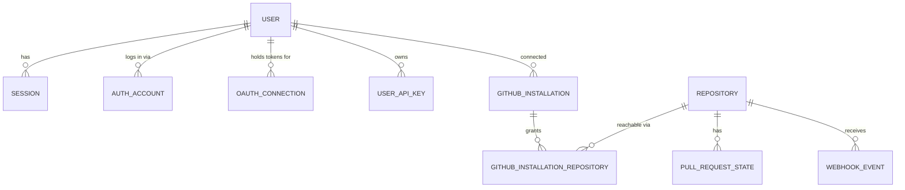

# Database

This document summarizes the PostgreSQL/Neon schema used by Tribunal. The live
schema lives in `packages/database/src/schema/` and is managed with Drizzle ORM.
The barrel at `packages/database/src/schema/index.ts` is the source of truth for
which tables exist — if a table is not exported there, it is not part of the
schema.

## Schema overview

Tribunal is intentionally minimal. There is no workspace/tenant layer, and the
only integration is GitHub. The surviving product flow is flat:

```
user → github_installation → github_installation_repository → repository → pull_request_state
```

A user logs in with GitHub, installs the GitHub App on one or more accounts, and
sees the open pull requests for the repositories that install grants access to.

### Tables the schema barrel exports

These groupings reflect exactly what `schema/index.ts` re-exports today:

- **Identity**: `user`, `session` (login sessions), `auth_account` (GitHub login
  identity), `oauth_connection` (encrypted GitHub API access tokens),
  `user_api_key` (hashed, customer-facing API keys).
- **GitHub installation**: `github_installation` (a GitHub App install bound to a
  user), `github_installation_repository` (which repositories an install can
  reach).
- **Repositories and pull requests**: `repository` (repo identity, keyed by the
  GitHub repo ID), `pull_request_state` (per-PR CI/review/merge snapshot).
- **Webhooks**: `github_webhook_delivery` (delivery idempotency),
  `webhook_event` (stored raw events per repository).

> [!NOTE] About the `auth_provider` and `oauth_provider` enums
> Both enums currently contain a single value, `github`. GitHub is the only
> supported provider for both login identity and API access.

### Vestigial tables still defined in the barrel

The barrel also still exports a handful of tables left over from a removed
automation layer. They are present in the TypeScript schema but are **not part of
the surviving product**, and nothing in the app reads or writes them as a live
feature:

- `pull_request_trigger`, `workflow_run`, `workflow_issue_reference`,
  `workflow_config` — modeled an automated PR-remediation system (durable
  workflow runs, per-workspace budgets, external issue references). That system,
  and the background job runner it depended on, no longer exists.
- `session_event` — an event-sourced log for an interactive planning feature that
  was removed.

These tables carry columns referencing concepts that are gone (`workspace_id`,
remediation phases, external issue trackers). Their backing enums in `enums.ts`
(`workflow_phase`, `workflow_task_type`, `error_category`, `issue_reference_type`,
`session_event_subtype`, and the `sync_status` field) likewise describe removed
behavior — the `linear` and `github` values on `issue_reference_type`, and the
goal/plan/task values on `session_event_subtype`, do **not** indicate any live
integration or planning feature. Treat all of this as dead schema awaiting
cleanup, not as documentation of current behavior. Do not build new features on
them; if you touch this area, prefer removing them over extending them.

## Entity relationship diagram

This diagram covers the live core flow. (The vestigial workflow/session tables are
omitted intentionally.)



Notes:

- `repository` uses the GitHub repository ID as its primary key (a natural,
  global key). `github_installation_repository` joins repositories to the
  installations that can reach them.
- `pull_request_state` is unique per `(repository_id, pr_number)` and stores the
  CI, review, and merge status surfaced in the UI.

## Key tables reference

| Table                            | Purpose                                                                     | Key relations                                                           |
| -------------------------------- | --------------------------------------------------------------------------- | ----------------------------------------------------------------------- |
| `user`                           | User accounts (GitHub identity, profile, platform-admin flag)               | `session`, `auth_account`, `oauth_connection`, `github_installation`    |
| `session`                        | Login sessions with expiry tracking                                         | `user` (cascade)                                                        |
| `auth_account`                   | Login identity per provider (currently GitHub only)                         | `user` (cascade)                                                        |
| `oauth_connection`               | Encrypted GitHub API access/refresh tokens                                  | `user` (cascade)                                                        |
| `user_api_key`                   | Hashed customer-facing API keys with prefix lookup                          | `user` (cascade)                                                        |
| `github_installation`            | A GitHub App install bound to a user, keyed by GitHub's installation ID     | `user` (cascade), `github_installation_repository`                      |
| `github_installation_repository` | Join table: which repositories an installation can reach                    | `github_installation` (cascade), `repository` (cascade)                 |
| `repository`                     | Repository identity (owner, name, default branch); PK is the GitHub repo ID | `pull_request_state`, `webhook_event`, `github_installation_repository` |
| `pull_request_state`             | Per-PR CI/review/merge snapshot, unique per `(repository_id, pr_number)`    | `repository` (cascade)                                                  |
| `github_webhook_delivery`        | Idempotency tracking keyed by GitHub delivery GUID + event type             | none (idempotency ledger)                                               |
| `webhook_event`                  | Stored raw webhook events per repository                                    | `repository` (cascade)                                                  |

> [!WARNING] Legacy migration history
> The committed migration history under `packages/database/drizzle/` predates the
> trim-down and still **creates** the full legacy schema (workspaces, projects,
> goals, plans, pipelines, tasks, questions, Linear tables, sandbox tables,
> analysis tables, and more). Those tables are not in the current TypeScript
> schema barrel, so Drizzle will report them as drift if you run a fresh
> `db:generate`. They remain in the SQL history only because migrations are
> append-only. Use the barrel — not the migration files — to determine what the
> application actually models.

## GitHub webhook flow

Webhook handling lives in `packages/github/src/webhooks/`. The skeleton is fully
present: signatures are verified, deliveries are claimed for idempotency, raw
events are stored, and a typed router dispatches to per-event handlers. The
handlers currently log instead of dispatching any background work — Tribunal has
no background job system.

The two tables backing this flow are:

- `github_webhook_delivery` — records each `(delivery_id, event_type)` so a
  redelivered webhook is skipped.
- `webhook_event` — stores the raw payload and extracted fields (event type,
  action, repository, PR/issue number, sender) for each event.

## Schema update workflow

Schema changes follow a **migration-first** workflow. Edit the TypeScript schema,
generate a SQL migration, review it, and commit it alongside the schema change.
All `db:*` scripts are defined in the root `package.json`.

### Steps

1. Edit the schema in `packages/database/src/schema/` (and add the new file to the
   barrel in `index.ts`).
2. Generate a migration:
   ```bash
   bun run db:generate
   ```
3. Review the generated SQL in `packages/database/drizzle/`.
4. Verify journal integrity:
   ```bash
   bun run db:check
   ```
5. Commit the schema change and migration SQL together.

The `database:migration:prepare` script chains these steps:

```bash
bun run database:migration:prepare
```

It runs `db:generate`, then `db:check`, then `check` (the full type check).

See `packages/database/MIGRATIONS.md` for the full migration authoring guide
(lock-safety patterns, multi-phase renames, backfills, and the pre-merge
checklist).

### Enum change rules

- **Additive changes** (new values) are safe in a single migration. Add the value
  to the `pgEnum` array in `enums.ts` (or the relevant schema file) and generate.
- **Removing a value** requires two phases: first migrate any rows using the old
  value to a replacement, deploy and verify, then generate the removal migration.
  The generated SQL drops and recreates the enum type, which fails if any rows
  still reference the old value.

### Forward-fix strategy

Rollback is not supported. If a migration introduces a problem, fix it forward:

1. Edit the TypeScript schema to the correct state.
2. Generate the fix migration with a descriptive name:
   ```bash
   bun run db:generate -- --name fix-describe-the-issue
   ```
3. Run the remaining preparation steps:
   ```bash
   bun run db:check && bun run check
   ```
4. Review the generated SQL and deploy.

Never manually edit committed migration SQL files — this breaks the journal hash
chain and causes `db:check` failures.

## CI validation

CI validates migrations on every pull request:

- **Journal integrity** (`bun run db:check`) — ensures the migration journal,
  snapshots, and SQL files are internally consistent. Catches a forgotten
  `db:generate`.
- **Clean application** — the `migration` job in `.github/workflows/ci.yml`
  applies the full migration history against a disposable Postgres 16 service,
  proving migrations apply from scratch.
- **Schema drift** (`packages/database/scripts/check-migration-consistency.ts`,
  run via `bun run --cwd packages/database check:migrations`) — runs
  `drizzle-kit generate` to a temp directory and checks whether uncommitted schema
  changes would produce new migrations.

If CI fails on a migration step:

- **db:check failure**: run `bun run db:check` locally and review the output.
- **db:migrate failure**: the generated SQL has a syntax or constraint error;
  review the failing migration file and fix the schema.
- **Schema drift failure**: you changed schema files but did not generate a
  migration. Run `bun run db:generate`.

To inspect which migrations have applied in an environment:

```sql
SELECT id, hash, created_at
FROM drizzle."__drizzle_migrations"
ORDER BY id DESC
LIMIT 10;
```

Compare against the journal at `packages/database/drizzle/meta/_journal.json` to
identify a failed migration, then generate a fix-forward migration. Do not roll
back or hand-edit the migrations table.

## Neon HTTP constraints

The runtime uses the `neon-http` driver (`drizzle-orm/neon-http`), which does not
support interactive transactions:

- Do not use `db.transaction()`.
- Use CTEs for atomic, multi-step writes where possible.
- For multi-step inserts, apply compensating deletes if a later step fails.

## Related references

- Schema source: `packages/database/src/schema/`
- Schema barrel (table inventory): `packages/database/src/schema/index.ts`
- Migration authoring guide: `packages/database/MIGRATIONS.md`
- Migration directory: `packages/database/drizzle/`
- Generated Zod schemas: `packages/schemas/src/`
  </content>
  </invoke>
